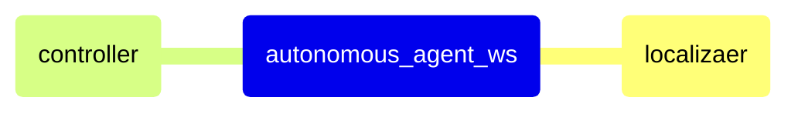

<div align="center">

  # Autonomous Air Purifier
  
  Indoor Autonomous Navigation of Mobile Robot with 2D LiDAR and Odometry

  [](https://docs.ros.org/en/humble/)
  [](http://gazebosim.org/)

</div>

--- 

## 🚀 Quick Start

1. Install `Dev Containers` in Vscode Extentions
2. Click `Reopen in Dev Container`
3. Build


```bash
# ~/autonomous_agent_ws

```

4. Run

```bash
ros2 launch self_drive_sim train_launch_map3.py
# or
ros2 launch self_drive_sim test_launch_map3.py
```

5. Simulation

[http://localhost:8080/vnc.html](http://localhost:8080/vnc.html)

---

## 🏗️ Technical Architecture

### Architecture Diagram



### Project Structure

    autonomous_agent_ws
    └── src/
        ├── 
        └── 

---

## Code

https://github.com/wontothree/autonomous_air_purifier_ws/blob/main/src/self_drive_sim/self_drive_sim/agent/agent.py

|Class||Function|
|---|---|---|
|`DistanceMatrixCalculator`|||
|`Map`||
|`Pose`||
|`Particle`||
|`MonteCarloLocalizer`||
|`LocalCostMapGenerator`||
|`GoToGoalController`||
|`AutonomousNavigator`||
|`Agent`||
|`ModelPredictivePathIntegralController`||


